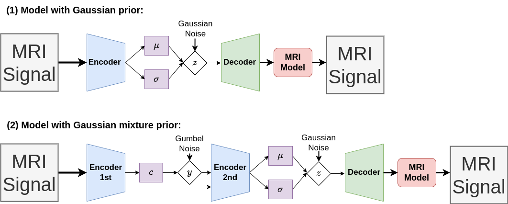
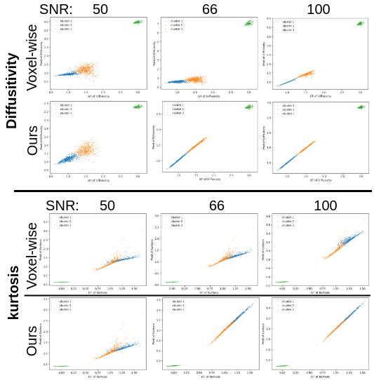
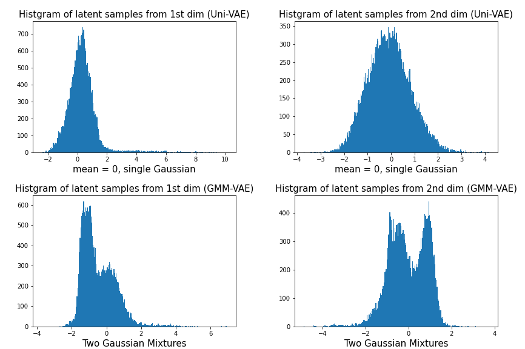

### (Under construction, only simulations available for now) Variational Mapping of MRI:
We introduce and demonstrate a new paradigm for quantitative parameter mapping in MRI.
Parameter mapping techniques, such as diffusion MRI (dMRI) and quantitative MRI (qMRI), have the potential to robustly and repeatably measure biologically-relevant tissue maps that strongly relate to underlying microstructure.
Quantitative maps are calculated by fitting a model to multiple images, e.g. with least-squares or machine learning. However, the overwhelming majority of model fitting techniques assume that each voxel is independent, ignoring any co-dependencies in the data. This makes model fitting sensitive to voxelwise measurement noise,  hampering reliability and repeatability.
We propose a self-supervised deep variational autoencoder  model fitting approach that breaks the assumption of independent pixels, leveraging redundancies in the data to effectively perform data-driven regularisation of quantitative maps.  
We demonstrate that our approach outperforms current model fitting techniques in dMRI simulations and real data.
Our approach enables improved quantitative maps and/or reduced acquisition times, and can hence support the clinical adoption of parameter mapping methods such as dMRI and qMRI.

[To do] Refactorizing the code for the real MRI data.

### Installation:
```shell
conda env create -f requirements.yaml
conda activate deep_mri
```

### Download HCP Data:
1. Apply for access first: https://www.humanconnectome.org/study/hcp-young-adult/data-use-terms 
2. After your access request is granted:
```shell
cd ..
mkdir data
cd data
gdown --folder https://drive.google.com/drive/folders/1HulbCuPAm4SltZN_iP83W8StaSQoirX3?usp=sharing
gdown --folder https://drive.google.com/drive/folders/1h7I8-ezSMMGNovkGsD2Ou7c6MI2tBypD?usp=sharing
```

### Running experiments:
```shell
python train_simulated.py --config 'configs/baseline_simulated.yaml' 
```

### Model architectures:
<br>
 
</br>


### Results on simulated data:
<br>
 
</br>

### Results on real data (HCP):
The visual results of the proposed methods (VAE-UniG and VAE-GMM) vs the non-dl and self-supervised baseline. Our methods can discover more anatomical structures as highlighted in the zoomed in areas.

<br>
 
</br>

### Visulisation of learnt posteriors:
<br>
 
</br>